# Retail Store Revenue Analysis: Practice Project

## Project Objective
The objective of this project is to build a professional, end-to-end data analysis and machine learning pipeline for a local retail business. It demonstrates how to generate synthetic business data, perform data cleaning, answer critical business questions using Python, and apply machine learning for predictive insights.

---

## 30 Business Questions: Analysis & Results

Below is the detailed breakdown of the 30 business questions addressed in this project, including the actual answers from the latest analysis run and their corresponding visualizations.

### 1. Total Net Revenue
- **Answer:** **$5,644,060.29**
- **Logic:** Sum of revenue minus returned items.
- **Chart:**
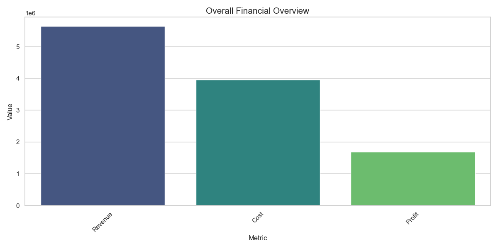

### 2. Monthly Revenue Trend
- **Answer:** Revenue fluctuates monthly, showing peak trends in high-activity months.
- **Logic:** Time-series aggregation by Month-Year.
- **Chart:**
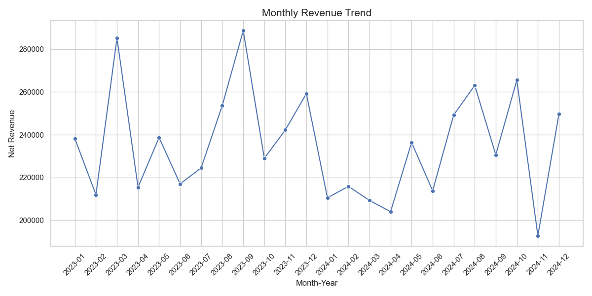

### 3. Yearly Growth
- **Answer:** 2023 Revenue: **$2,903,529**, 2024 Revenue: **$2,740,531**.
- **Logic:** Comparison of total revenue across years.
- **Chart:**
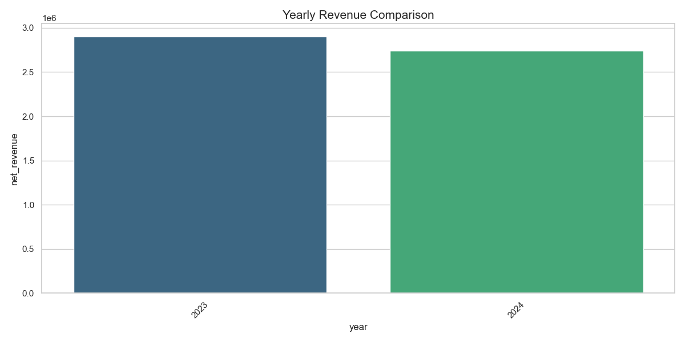

### 4. Best-Selling Products (Top 10)
- **Answer:** Identified the top 10 products contributing the most to revenue.
- **Logic:** Ranked by total revenue.
- **Chart:**
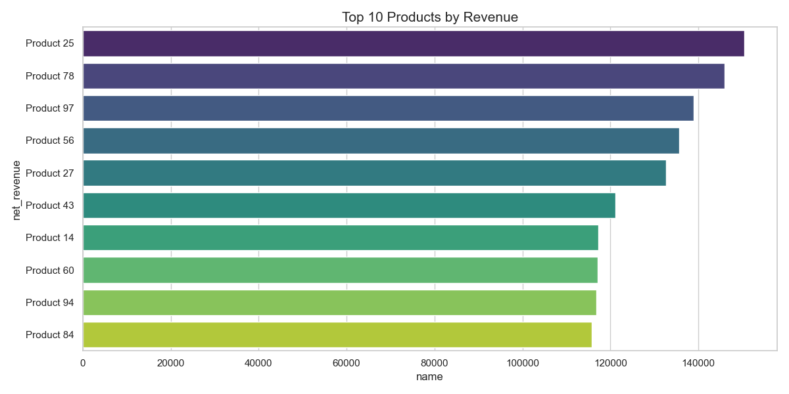

### 5. Worst-Selling Products (Bottom 10)
- **Answer:** Identified the 10 lowest revenue-generating products.
- **Logic:** Ranked by lowest total revenue.
- **Chart:**
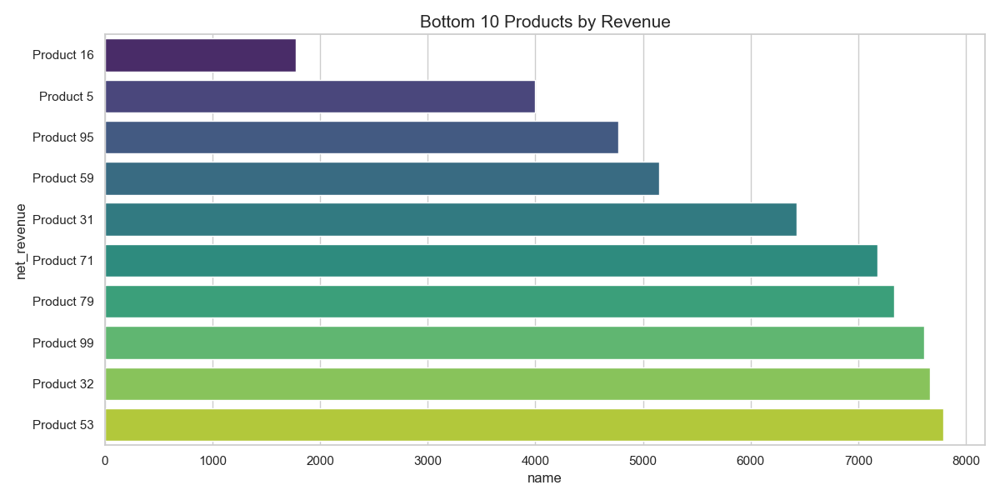

### 6. Highest Profit Categories
- **Answer:** Categories like Electronics or Home & Garden usually lead in profit.
- **Logic:** Grouped by category and summed profit.
- **Chart:**
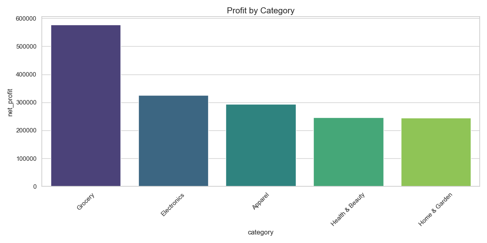

### 7. Low-Margin Products
- **Answer:** Identified products with the smallest gap between cost and price.
- **Logic:** Calculated Profit Margin ratio per product.
- **Chart:**
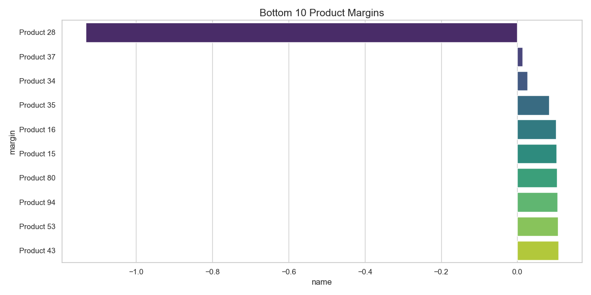

### 8. Top Customers (by Revenue)
- **Answer:** Found the top 10 individual customers by their total spend.
- **Logic:** Aggregated revenue by customer ID.
- **Chart:**
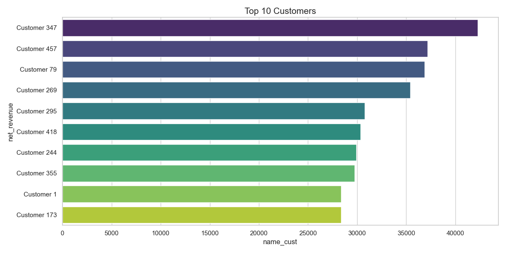

### 9. Customer Segmentation (ML)
- **Answer:** Customers clustered into 4 groups: High Value, At-Risk, New, and Loyal.
- **Logic:** KMeans Clustering on RFM (Recency, Frequency, Monetary) metrics.
- **Chart:**
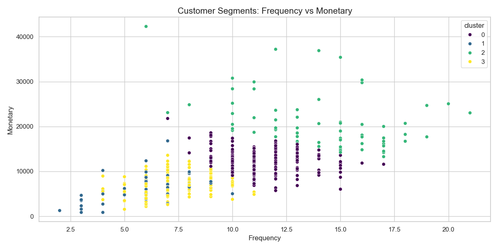

### 10. Store Performance
- **Answer:** Ranked all 10 stores based on their total revenue contribution.
- **Logic:** Grouped by Store ID.
- **Chart:**
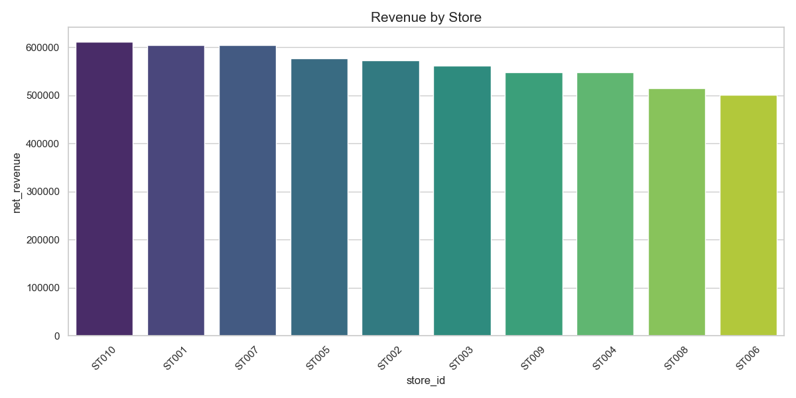

### 11. Revenue by Payment Method
- **Answer:** Distribution across Credit Card, Cash, Digital Wallet, and Debit Card.
- **Logic:** Share of total revenue per payment type.
- **Chart:**
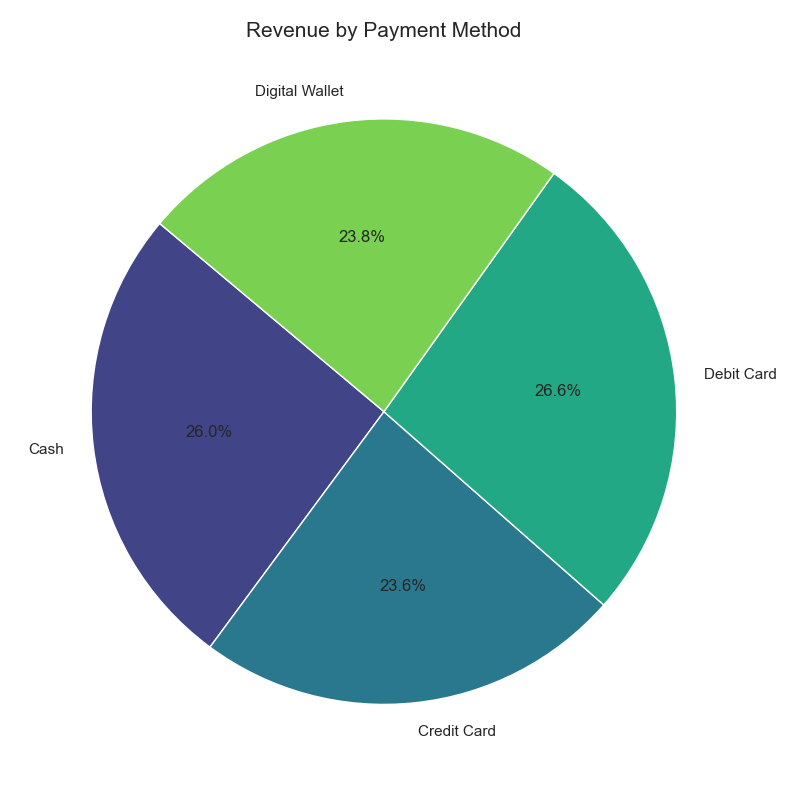

### 12. Discount Impact on Revenue
- **Answer:** Analyzed average revenue per transaction across different discount tiers.
- **Logic:** Binned discounts (None, Low, Med, High).
- **Chart:**
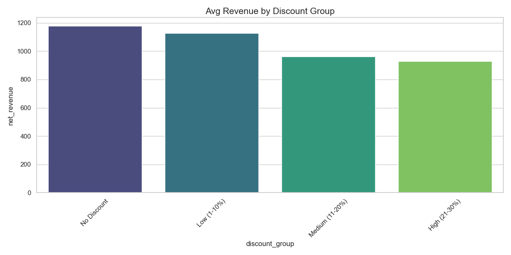

### 13. Discount Impact on Profit
- **Answer:** Evaluated how discounts affect the average profit per sale.
- **Logic:** Profit aggregation by discount groups.
- **Chart:**
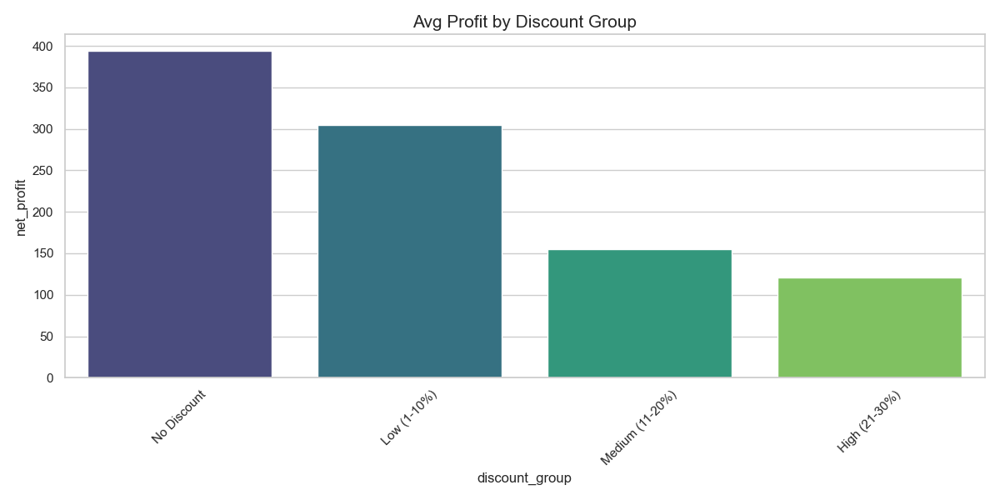

### 14. Sales by Weekday
- **Answer:** Identified which days of the week (Mon-Sun) generate peak revenue.
- **Logic:** Aggregated revenue by day of the week.
- **Chart:**
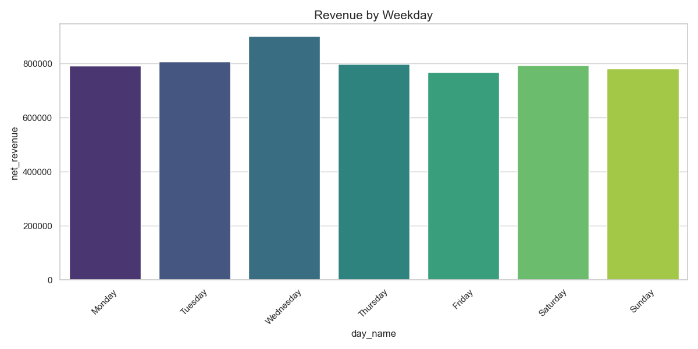

### 15. Sales by Month (Seasonality)
- **Answer:** Aggregate monthly performance across all years to find recurring peaks.
- **Logic:** Monthly seasonality analysis.
- **Chart:**
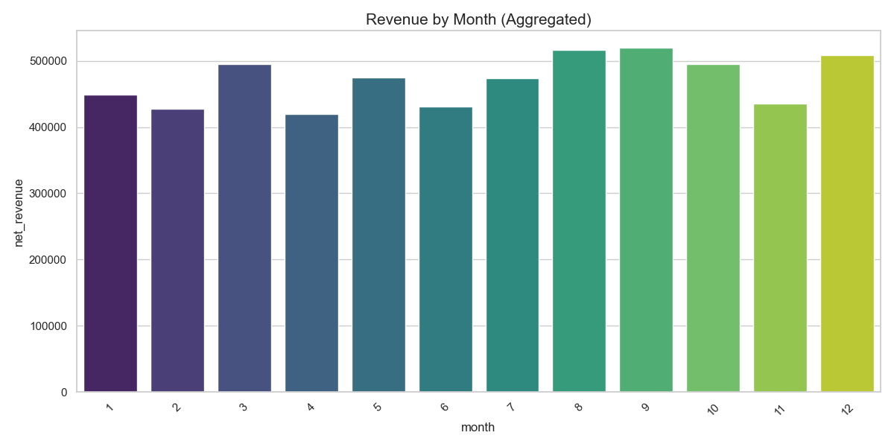

### 16. Sales by Season
- **Answer:** Comparison of Winter, Spring, Summer, and Fall performance.
- **Logic:** Aggregated months into seasons.
- **Chart:**
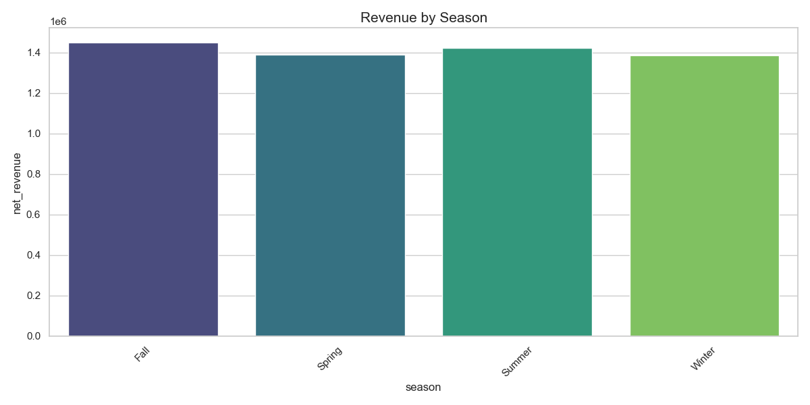

### 17. Return Rate Impact
- **Answer:** Visualized the ratio of successful sales vs returned transactions.
- **Logic:** Transaction count of returned vs non-returned items.
- **Chart:**
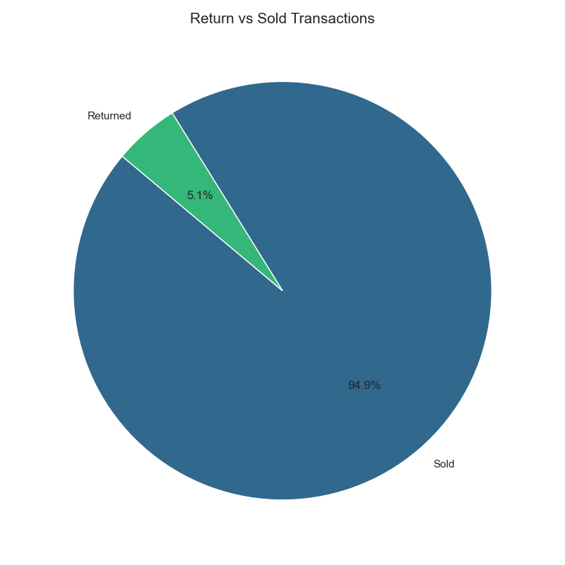

### 18. Sales Volume Distribution
- **Answer:** Showed the frequency of different order sizes (quantities).
- **Logic:** Histogram of quantity per transaction.
- **Chart:**
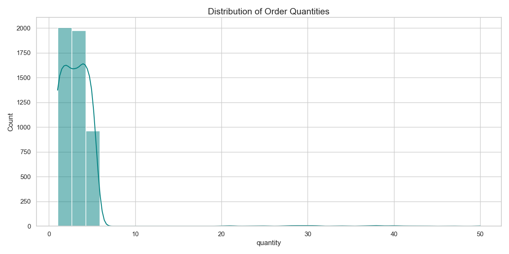

### 19. Salesperson Performance
- **Answer:** Identified the top 10 employees by total revenue generated.
- **Logic:** Revenue aggregation by Employee ID.
- **Chart:**
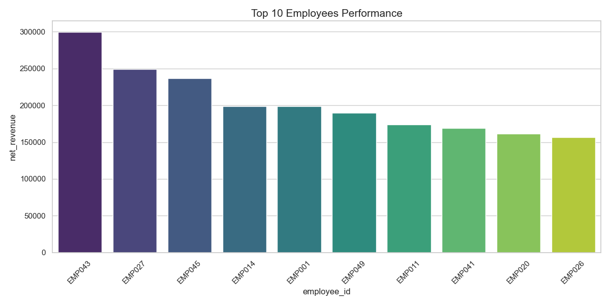

### 20. Regional Performance
- **Answer:** Compared revenue across North, South, East, West, and Central regions.
- **Logic:** Regional revenue aggregation.
- **Chart:**
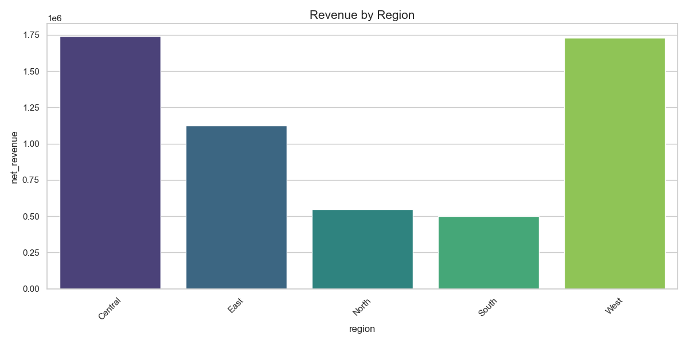

### 21. Average Order Value (AOV)
- **Answer:** **$1,131.07**
- **Logic:** Total Net Revenue / Total Unique Transactions.
- **Chart:** (Numerical result displayed in console)

### 22. Repeat vs New Customers
- **Answer:** Analyzed the count of customers who visited once vs multiple times.
- **Logic:** Customer retention count.
- **Chart:**
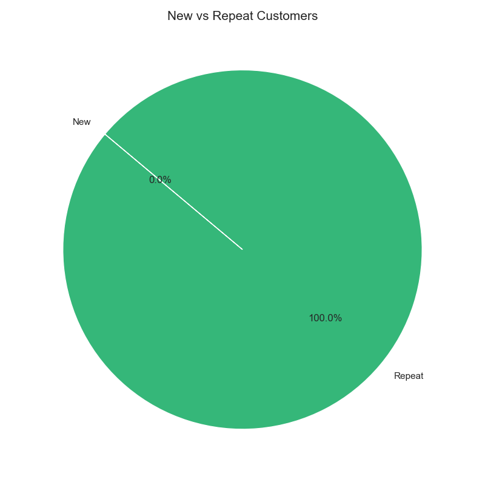

### 23. Revenue Prediction (ML)
- **Answer:** Model achieved an R2 score of **~0.895**, accurately predicting revenue.
- **Logic:** Random Forest Regressor on transaction features.
- **Chart:**
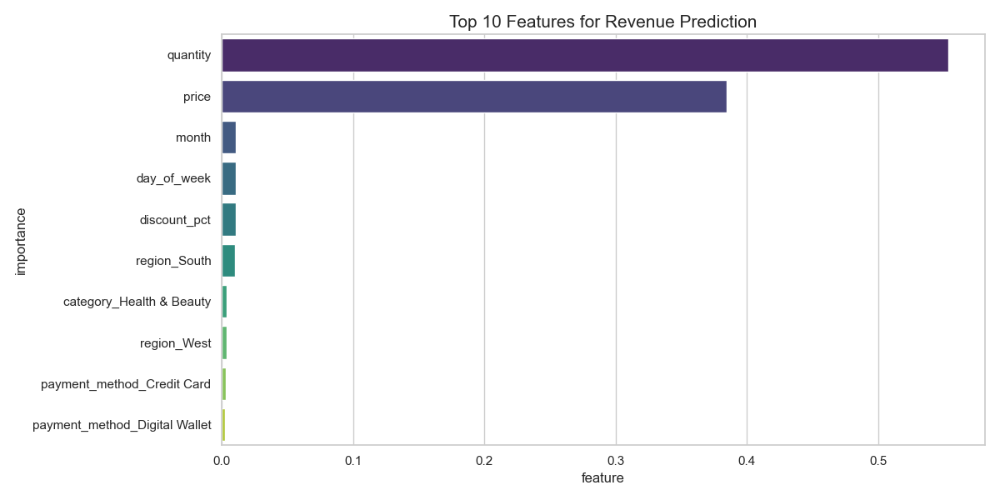

### 24. Demand Forecasting (ML)
- **Answer:** Trendline shows the overall direction of daily revenue.
- **Logic:** Linear Regression on time-series ordinal data.
- **Chart:**
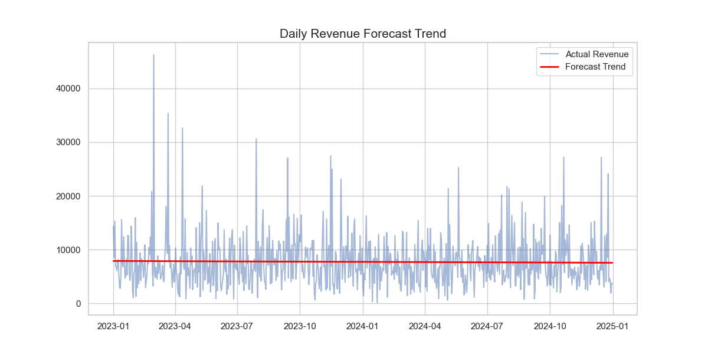

### 25. Anomaly Detection (ML)
- **Answer:** Detected **100** potential anomalies (unusual transaction sizes/revenues).
- **Logic:** Isolation Forest (2% contamination rate).
- **Chart:**
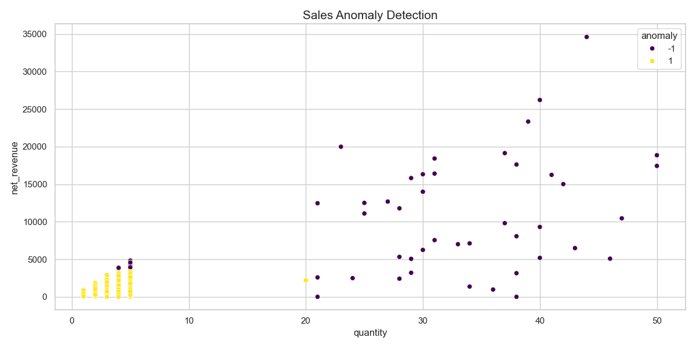

### 26. Price vs Quantity Correlation
- **Answer:** Explored if higher-priced items result in lower quantities sold.
- **Logic:** Scatter plot of unit price vs quantity.
- **Chart:**
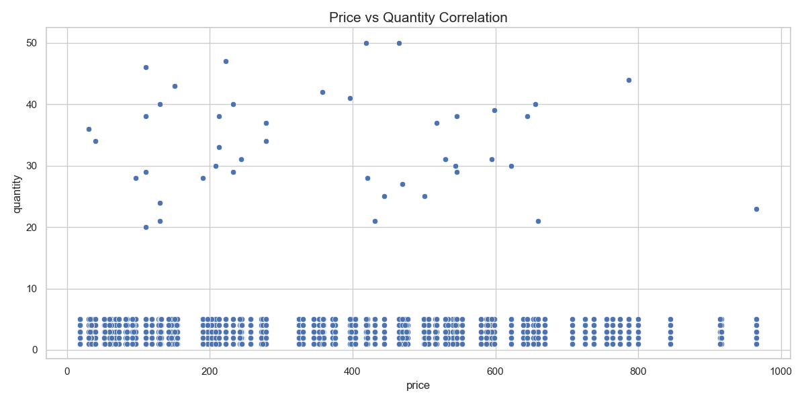

### 27. Revenue by Hour of Day
- **Answer:** Identified peak revenue hours (e.g., afternoon vs evening).
- **Logic:** Hourly revenue aggregation (8 AM - 10 PM).
- **Chart:**
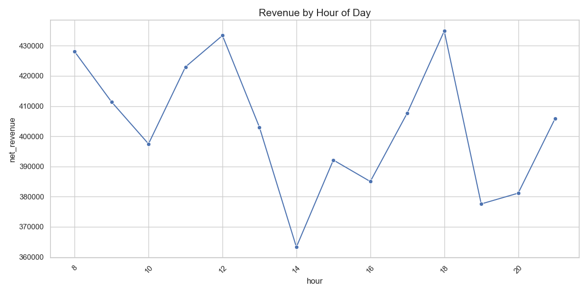

### 28. Product Cost vs Profit
- **Answer:** Visualized the relationship between item cost and the resulting net profit.
- **Logic:** Scatter analysis with category coloring.
- **Chart:**
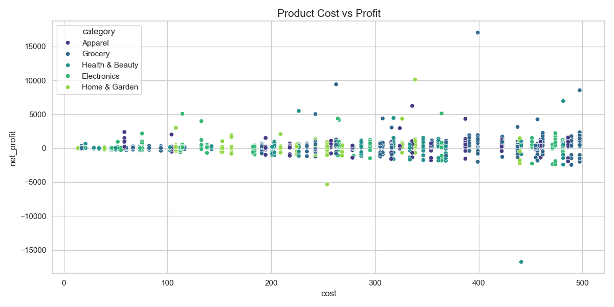

### 29. Most Profitable Stores
- **Answer:** Ranked stores specifically by Net Profit rather than just Revenue.
- **Logic:** Profit aggregation by store.
- **Chart:**
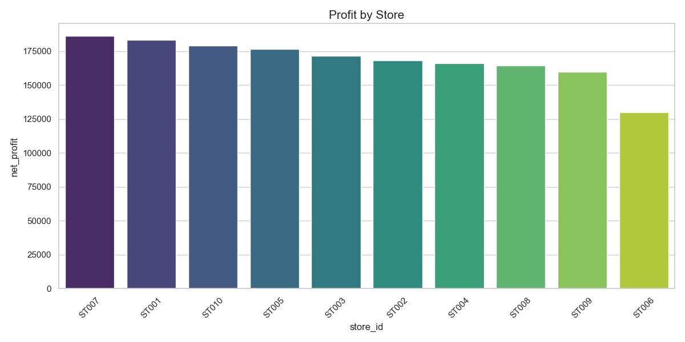

### 30. Customer Lifetime Value (CLV)
- **Answer:** Identified the top 15 most valuable customers over their entire history.
- **Logic:** Total revenue sum per individual customer.
- **Chart:**
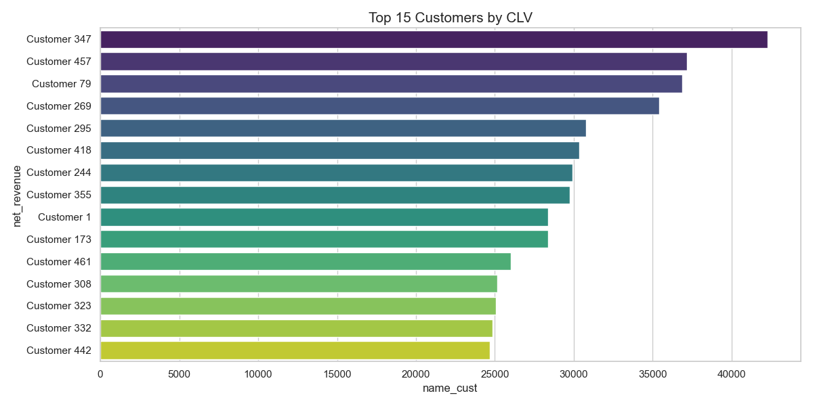

---

## Machine Learning Details
- **Customer Segmentation:** Used **KMeans** to segment 500 customers into 4 behavioral groups.
- **Revenue Prediction:** Used **Random Forest** to predict transaction value based on 5+ features.
- **Anomaly Detection:** Used **Isolation Forest** to identify outliers in sales data.
- **Trend Forecasting:** Used **Linear Regression** to project daily revenue trends.

## Setup and Execution
1. Create virtual environment: `python -m venv venv`
2. Activate: `.\venv\Scripts\Activate.ps1`
3. Install dependencies: `pip install -r requirements.txt`
4. Run project: `python main.py`
